# TELECOM--END-TO-END-PROJECT

# Telco Customer Churn Analysis
### End-to-End Data Analytics Portfolio Project
Analysed 7,032 customer records to uncover why a fictional telecom company was losing 26.6% of its customers annually, which is above industry average. I Built a full analytics pipeline across four tools, identified contract type and tenure as the biggest churn drivers, and recommended strategies projected to recover over $450K in recurring revenue.

**Tools:** Excel | MySQL | Python (Pandas, Matplotlib, Seaborn) | Power BI

---

| Churn Rate | Customers Analysed | Revenue Lost to Churn | Monthly Revenue at Risk |
|---|---|---|---|
| 26.6% | 7,032 | $2,862,926 | $139,131 / month |

---

## 1. The Business Problem

Telco, a fictional mid-sized telecommunications company, is losing customers. Despite spending millions acquiring new ones, a significant portion leave within the first year quietly, with no warning. Their marketing team was spending heavily to bring new people in, but a significant portion of those customers were quietly cancelling within months of signing up.

The CEO framed the challenge in three questions:

- Why are our customers leaving?
- Who is most likely to churn next?
- What can we do to keep them?

The financial motivation was clear: it costs 5x more to acquire a new customer than to retain one, and a 5% reduction in churn would save the business an estimated $2 million annually. My job was to turn 7,043 rows of customer data into answers the business could act on.

---

## 2. The Dataset

- **Source:** IBM Telco Customer Churn Dataset via Kaggle
- **Size:** 7,043 customers, 21 columns (7,032 after cleaning)

The dataset covers customer demographics (gender, age, dependents), account details (tenure, contract type, payment method), services subscribed to (phone, internet, security, backup, streaming), billing amounts, and a churn column indicating whether each customer left.

---

## 3. My Approach

I used a progressive cleaning pipeline - each tool built on the work of the one before it. I never modified the original file; every stage produced a cleaner version that fed into the next.

Raw CSV → Excel (initial clean) → MySQL (deep clean + analysis) → Python (EDA + visualisations) → Power BI (dashboard)

---
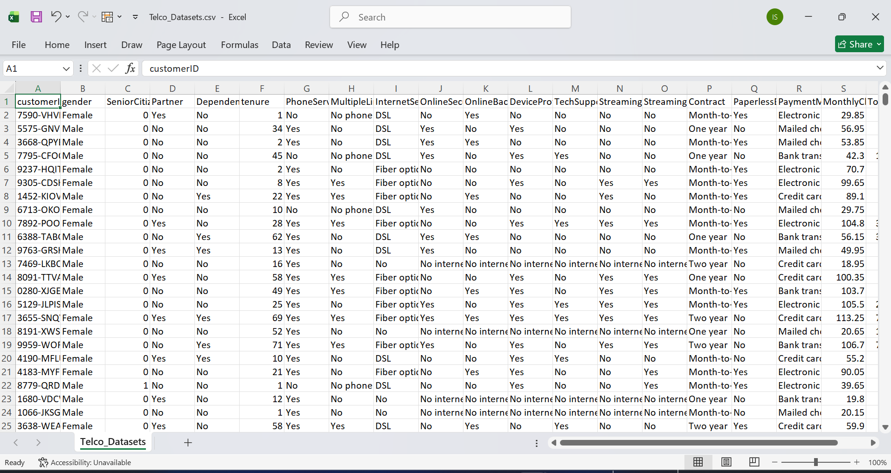

### Step 1 - Excel: First Look and Initial Cleaning

Before writing a single query or line of code, I opened the raw CSV in Excel to understand what I was working with. This is where I caught some obvious problems.

- Removed duplicate rows
- Standardised redundant values - seven service columns all contained 'No internet service' as a value, which was just a verbose way of saying 'No.' I replaced all of them to keep the data consistent
- Dropped unnecessary columns that added noise without adding insight
- Renamed columns to be clearer and more readable
- Saved the cleaned version as the source file for SQL

---

### Step 2 - MySQL: Deep Cleaning and Business Analysis

With the cleaned Excel file imported into MySQL Workbench, I went much deeper. SQL is where I turned raw rows into actual business answers.

**Cleaning**

- Trimmed whitespace from all text columns to prevent grouping errors in queries
- Used UPDATE statements to catch any remaining inconsistent values
- Fixed a BOM encoding issue that corrupted the customerID column name on import - renamed `customerID` back to `customerID`. I'd use Google Sheets or Notepad++ to convert the file before importing next time to avoid this
- Split the tenure column into four customer groups: New (0–5 months), Early (6–11), One-Year (12–23), Loyal (24+)
- Used `SET SQL_SAFE_UPDATES = 0/1` to toggle safe mode when running bulk UPDATE queries - prevents accidental updates to all rows if a WHERE clause is missing

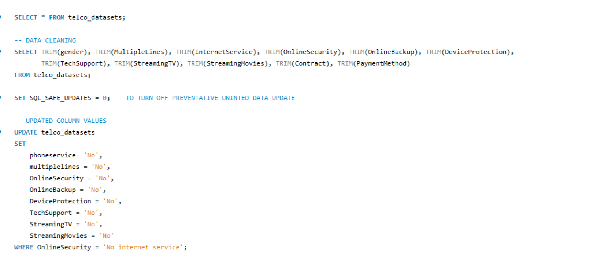

**Business Queries**

- Overall churn rate
- Churn rate by contract type
- Churn rate by tenure group
- Revenue analysis - five separate angles: total vs lost, by churn status, by contract type, by payment method, and Monthly Recurring Revenue (MRR) at risk
- Churn rate by service combinations

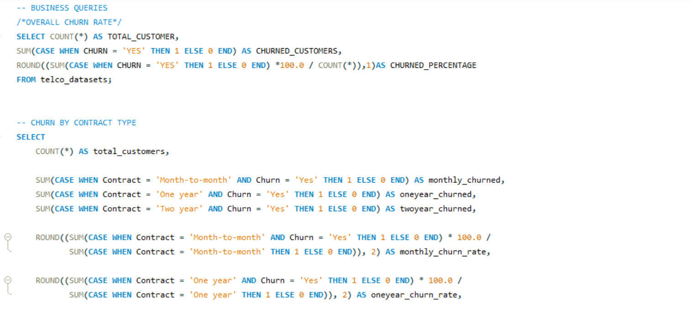

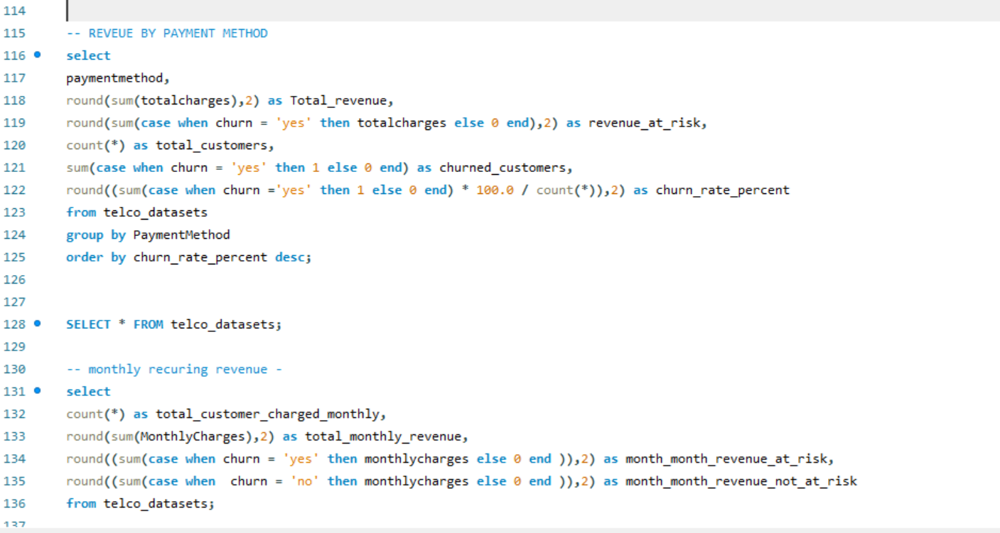

---

### Step 3 — Python: Exploratory Analysis and Visualisations

After validating the key numbers in SQL, I moved into Python for deeper statistical work and visualisations that would make the patterns visible.

**What I built**

- **Customer Lifetime Value (CLV):** MonthlyCharges × tenure - the total value each customer has delivered
- **Total_Service_Used:** Converted all service columns from Yes/No to 1/0 and summed them to see how many services each customer uses out of 9 available
- **Risk Score model:** A custom 0–100 scoring system that classifies every customer as Low, Medium, or High Risk based on five churn indicators
- Correlation matrix to statistically validate the patterns found in SQL
- Distribution analysis on monthly charges and tenure

**Visualisations**

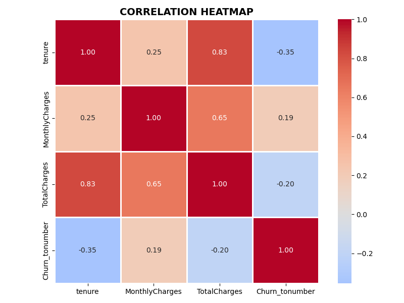

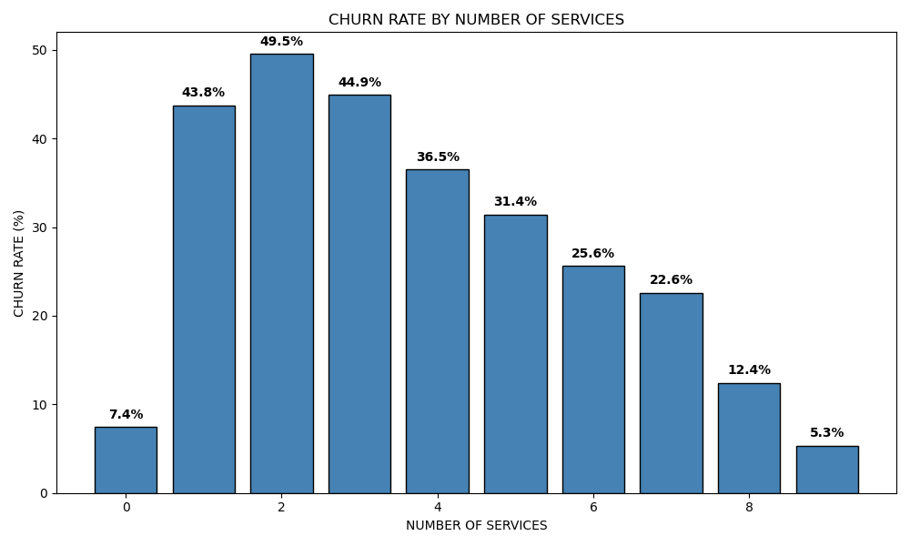
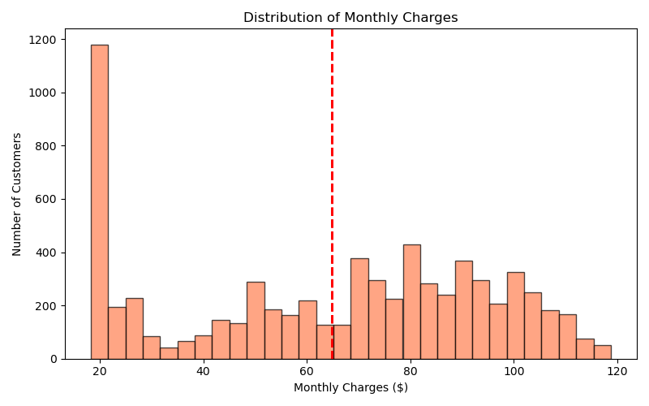
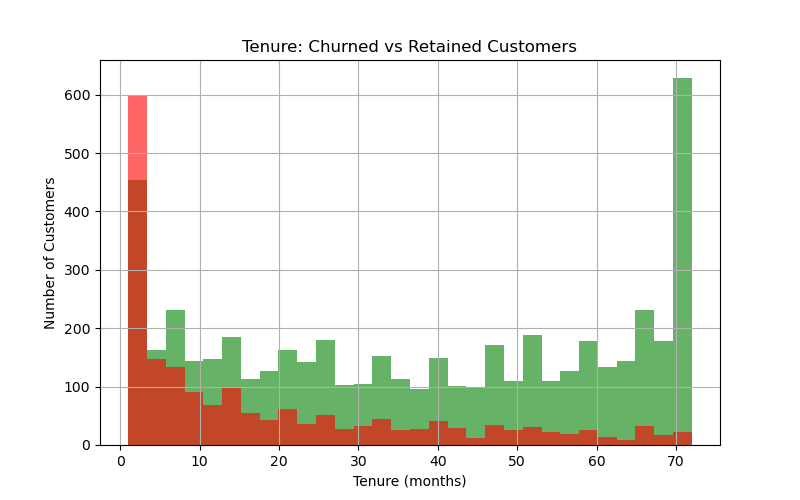

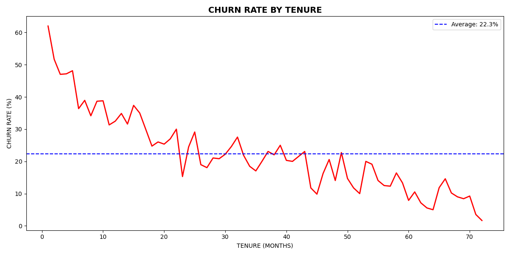

---

### Step 4 - Power BI: Interactive Dashboard

The final step was turning everything into a dashboard a non-technical manager could use - no SQL, no code, just answers on a screen.

- KPI cards: overall churn rate, total customers, revenue at risk, average CLV
- Churn by contract type bar chart
- Retention curve showing how churn rate falls as tenure increases
- Service engagement breakdown
- Slicers for contract type, tenure range, and monthly charge range

> I used a reference table to unpivot the service columns rather than modifying the original dataset. This keeps the source data intact and is considered best practice in Power BI modelling.

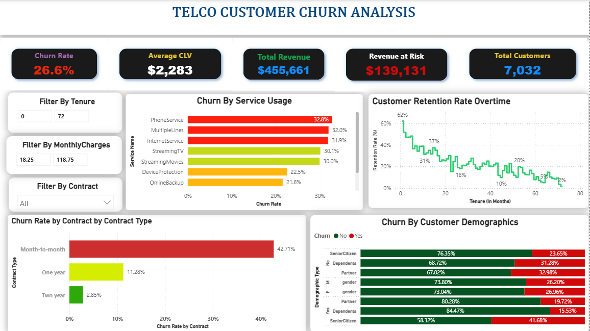
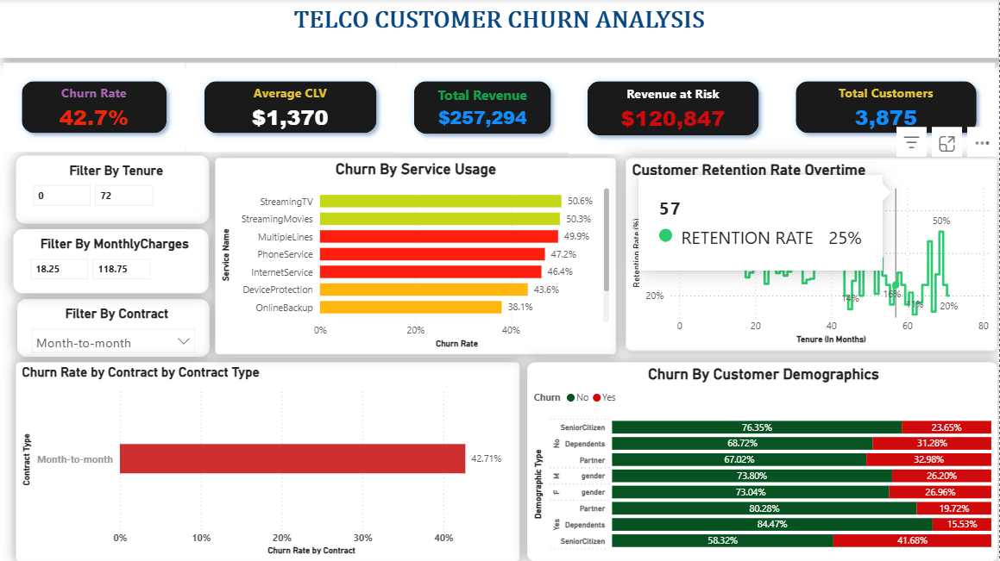

---

## 4. Key Findings

### Finding 1 - The churn rate is worse than the industry average

The company's churn rate is 26.6%, meaning roughly 1 in 4 customers is leaving. The telecom industry benchmark sits at 18–25%. That gap is not a minor inefficiency. Of 7,032 customers, 1,869 have already churned, taking $2.86 million in lifetime revenue with them. The business is losing customers at a rate it cannot sustain without addressing the root causes.

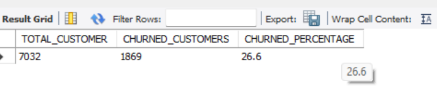

---

### Finding 2 — Contract type is the single biggest churn driver

This was the most striking finding in the entire analysis. The difference between contract types is not gradual but dramatic.

| Contract Type | Churn Rate | Interpretation |
|---|---|---|
| Month-to-Month | 42.71% | Nearly half of these customers will leave |
| One Year | 11.28% | Committed customers - manageable risk |
| Two Year | 2.85% | Almost zero churn - these are loyal customers |

A month-to-month customer is 15x more likely to churn than someone on a two-year contract. The contract is not just a billing arrangement, it is the strongest predictor of whether a customer stays or goes. With no long-term commitment, there is no barrier to leaving the moment a competitor makes a better offer.

---

### Finding 3 - New customers are leaving before they have settled in

Breaking churn down by tenure group revealed the clearest pattern in the data.

| Tenure Group | Period | Churn Rate |
|---|---|---|
| New | 0–5 months | 54.71% |
| Early | 6–11 months | 36.53% |
| One-Year | 12–23 months | 29.51% |
| Loyal | 24+ months | 14.29% |

More than half of all new customers leave within the first five months. They never stayed long enough to see the full value of the service. The positive side of this finding is that if the company can successfully engage customers through the first six months, retention improves significantly. **The first 90 days are make or break.**

---

### Finding 4 - Revenue is bleeding every month

| Metric | Amount |
|---|---|
| Total revenue (all customers) | $16,056,168 |
| Revenue lost to churned customers | $2,862,926 |
| Revenue retained (active customers) | $13,193,241 |
| Monthly revenue currently at risk | $139,131 per month |

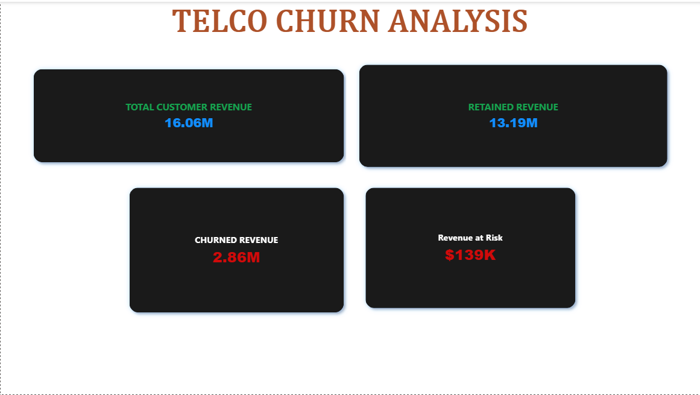
Churned customers were contributing $139,130 every month before they cancelled. That recurring gap needs to be replaced just to stand still, before any growth target is considered. Annualised, that is over $1.67 million in recurring revenue the business has lost access to.

---

### Finding 5 - The more services a customer uses, the less likely they are to leave

| Services Used | Approximate Churn Rate |
|---|---|
| 1–2 services | ~49% |
| 3–4 services | ~37–44% |
| 5–6 services | ~25–31% |
| 7–9 services | ~5–22% |

Every additional service a customer subscribes to increases switching costs. Leaving means losing multiple things at once, not just one. The data makes a clear case that bundling is not just a sales strategy - it is a retention strategy.

---

### Finding 6 - Correlation analysis confirms the patterns statistically

| Variable | Correlation with Churn | What It Means |
|---|---|---|
| Tenure | -0.35 | Strongest predictor - longer tenure means significantly less churn |
| MonthlyCharges | +0.19 | Higher bills slightly increase churn risk |
| TotalCharges | -0.20 | High total spend reflects long tenure, not high risk |

Tenure is the strongest single variable correlated with churn. The longer someone has been a customer, the more embedded they are and the less likely they are to leave. Monthly charges show a mild positive correlation - customers on higher plans may feel more price-sensitive, particularly those on flexible month-to-month contracts.

---

### Finding 7- Risk scoring model flags at-risk customers before they cancel

I built a risk scoring system in Python that assigns each customer a score from 0 to 100 based on five churn indicators, then groups them into Low, Medium, or High Risk.

| Risk Factor | Points | Reasoning |
|---|---|---|
| Tenure under 12 months | +30 | New customers are the highest-risk group |
| Month-to-month contract | +25 | No commitment means no barrier to leaving |
| Monthly charges over $70 | +20 | Higher bills increase price sensitivity |
| Fewer than 3 services used | +15 | Low engagement means low switching cost |
| No tech support | +10 | Unresolved issues push customers away |

| Risk Category | Customer Count | Churn Rate |
|---|---|---|
| Low Risk (0-39) | 2,599 | 17.63% |
| Medium Risk (40-69) | 4,402 | 49.33% |
| High Risk (70-100) | 31 | 61.11% |

The High Risk group is small but urgent — 31 customers flagged by the model as the most likely to leave. These are the customers the retention team should prioritise contacting this week.

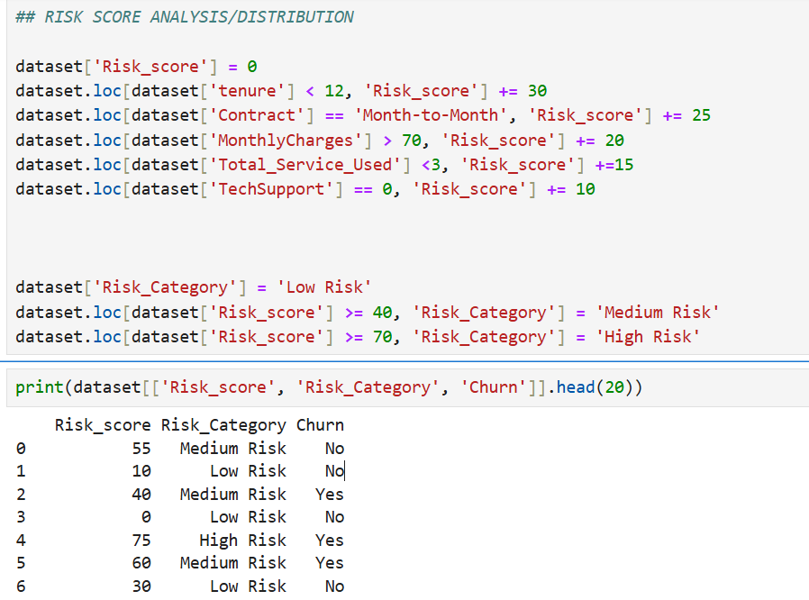

---

## 5. Business Recommendations

- Every recommendation below is tied directly to a finding in the data. These are not generic suggestions - they are responses to specific patterns found in 7,032 real customer records.

### 1. Fix the onboarding experience
Over half of new customers leave within five months. They never got the chance to experience the product's full value. I would recommend a structured 90-day onboarding programme - check-ins at days 7, 30, and 90, a personalised welcome guide in week one, and automated alerts when a new customer has not engaged with more than two services after 30 days.

### 2. Incentivise contract upgrades
Month-to-month customers churn at 42.71%. Two-year customers churn at 2.85%. The gap is enormous. Offering a meaningful discount around 15% to month-to-month customers who upgrade to an annual contract would directly address the biggest driver of churn. Even converting 20% of month-to-month customers to annual contracts could save over $500,000 in annual recurring revenue.

### 3. Drive service bundle adoption
Moving a customer from two services to four reduces their churn probability by roughly 15 percentage points based on the data. I would recommend discounted bundle packages, training customer service agents to mention one additional service on every inbound call, and a 30-day free trial for Online Security and Tech Support specifically - the two add-ons most correlated with retention.

### 4. Move electronic check users onto auto-pay
Electronic check users showed the highest churn rate of any payment method. Offering a small monthly discount around $5 to switch to bank transfer or credit card auto-pay reduces billing friction and makes cancellation a more deliberate decision rather than an automatic one.

### 5. Use the risk score model to prioritise retention spend
Rather than contacting all customers reactively, the retention team should export the High and Medium Risk segments from the dashboard each week. The 31 High Risk customers should receive a personal call with a loyalty offer. The 4,402 Medium Risk customers should receive an automated personalised email monthly. The goal is to reach people before they cancel, not after.

---

## 6. Tools and Skills

| Tool | How I Used It | Key Techniques |
|---|---|---|
| Excel | Initial cleaning and exploration | Duplicate removal, value standardisation, column formatting |
| MySQL | Data cleaning and business queries | UPDATE, CASE WHEN, GROUP BY, SUM, COUNT, ROUND, tenure segmentation |
| Python — Pandas | Feature engineering and statistics | Calculated columns (CLV, Total Services, Risk Score), correlation matrix |
| Python — Matplotlib / Seaborn | Visualisations | Line charts, bar charts, histograms, heatmaps |
| Power BI | Interactive dashboard | DAX measures, slicers, KPI cards, reference table for unpivoting |
| GitHub | Documentation and version control | README, project folder structure |

---

## 7. Conclusion

This project started with a simple but urgent business question - why are customers leaving, and what can we do about it? Working through four tools across the full analytics pipeline, the data gave clear answers. The churn problem is real, it is measurable, and it is fixable. Contract type, tenure, and service engagement are not just interesting patterns - they are levers the business can pull. Locking more customers into annual contracts, getting new customers through the critical first 90 days, and encouraging bundle adoption are not expensive interventions. But based on the numbers in this analysis, they could realistically recover hundreds of thousands in recurring revenue annually and bring the churn rate down from 26.6% closer to the industry benchmark of 15–25%. The goal of this analysis was never just to describe the problem - it was to give the business something it could act on tomorrow morning. I believe this does that.

---

*This project is part of my data analytics portfolio. Built end-to-end to demonstrate real-world problem solving - from raw data to business recommendations.*
Loan Prediction Next>>>
